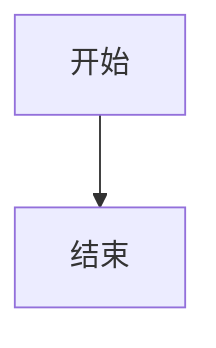

# Purpose

Generate Mermaid code blocks for Feishu documents.

# Output rule

Always return fenced Mermaid blocks, for example:

# Hard rules

- Do not output plaintext pseudocode.
- Do not output SVG.
- Do not output Mermaid without fenced code block syntax.
