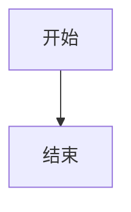

# Purpose

Use this skill to transform structured output from `integration_clinical_decision_support` into a standardized clinical decision support report for MDT preparation.

This skill is a formatter and template enforcer.
It must not invent new clinical conclusions, treatment recommendations, evidence, or biomarker interpretations.

The output of this skill must be suitable for Feishu document writing and must preserve a stable section structure across cancer types.

# When to use

Use this skill only when all of the following conditions are met:

1. A structured case summary has already been prepared.
2. `integration_clinical_decision_support` has already returned structured recommendation content.
3. The system needs to generate the second document in `/mdt_prep`, namely:
   - AI clinical decision support report
   - independent pre-MDT recommendation document

Do not use this skill for:
- raw case intake
- meeting minutes
- post-MDT summary
- freeform clinical reasoning without CDS output

# Inputs required

This skill expects the following structured inputs:

- `case_data`
  - structured patient facts from `core_intake`
- `cds_output`
  - structured output from `integration_clinical_decision_support`
- `guideline_evidence`
  - optional structured guideline support
- `trial_evidence`
  - optional structured trial support
- `drug_analysis`
  - optional structured drug or regimen support
- `document_meta`
  - optional metadata such as cancer type, patient key features, report date, version

If the required sections are missing from `cds_output`, this skill must preserve the section heading and explicitly mark content as unavailable or pending confirmation.

# Core rule

This skill must NEVER generate treatment recommendations on its own.

It may:
- reorganize
- normalize wording
- merge duplicated evidence
- convert lists into tables
- standardize section names
- convert decision logic into Mermaid blocks

It must NOT:
- infer a new line of therapy
- upgrade or downgrade recommendation strength
- add unsupported biomarker meaning
- fabricate trials, guidelines, references, or toxicities

# Output objective

Return a fully formatted report with the following exact section structure:

1. 执行摘要
2. 患者特征
3. 治疗方案详解
4. 专项评估模块（按病例触发）
5. 监测与支持计划
6. MDT讨论要点
7. 随访与后续计划
8. 参考依据
9. Mermaid 决策流程图
10. 最终推荐与关键决策点

All section headings must be preserved in Chinese.

# Output format

Return output as structured content for Feishu document rendering, using the following schema:

```json
{
  "title": "",
  "subtitle": "",
  "sections": [
    {
      "heading": "",
      "content": ""
    }
  ],
  "tables": [
    {
      "title": "",
      "columns": [],
      "rows": []
    }
  ],
  "diagram_blocks": [
    {
      "title": "",
      "format": "mermaid",
      "markdown_block": "```mermaid\n...\n```"
    }
  ],
  "warnings": [],
  "source_trace": []
}
```

# Title rule

The title must follow this pattern:

`[癌种]临床决策支持报告 - [关键特征]`

Examples:
- 食管癌临床决策支持报告 - 高龄 / PD-L1高表达 / 局部晚期
- 肺癌临床决策支持报告 - EGFR突变 / IV期
- 结直肠癌临床决策支持报告 - 肝转移 / KRAS野生型

If cancer type is uncertain, use:
`肿瘤临床决策支持报告 - 待进一步明确`

# Section rules

## 1. 执行摘要

This section is mandatory.

It must contain:
- 文档说明
- 疾病状态
- 患者关键特征
- 分析框架
- 推荐方案总表
- 生物标志物结论
- 本患者优先路径
- 风险提示
- 是否建议 MDT 重点讨论

## 2. 患者特征

This section is mandatory.
It must contain factual case description only and must NOT include treatment recommendations.

## 3. 治疗方案详解

This section is mandatory.
Each candidate plan must use a uniform structure:
- 方案名称
- 推荐等级
- 适用条件
- 方案内容
- 主要毒性/风险
- 监测要求
- 不适用情况
- 推荐理由
- 证据来源

All plans must come from CDS output.

## 4. 专项评估模块（按病例触发）

This section heading is mandatory.
If no special module is triggered, write: `当前未触发需要单列展开的专项评估模块。`

## 5. 监测与支持计划

This section is mandatory.
Prefer table format.

## 6. MDT讨论要点

This section is mandatory.
It is the pre-meeting focus list, not the final meeting summary.

## 7. 随访与后续计划

This section is mandatory.

## 8. 参考依据

This section is mandatory.
Do not fabricate citations.

## 9. Mermaid 决策流程图

This section is mandatory.
Return exactly two Mermaid blocks whenever possible:
1. 通用决策路径
2. 本患者具体路径

Each block must be written as a fenced Mermaid code block:



Do not output plaintext pseudocode.
Do not output SVG.
Do not output Mermaid without fenced code block syntax.

## 10. 最终推荐与关键决策点

This section is mandatory.
It must include:
- 最终推荐
- 备选路径
- 当前不优先推荐的路径（如适用）
- 关键决策点列表

The content of this section must be consistent with the executive summary.

# Consistency rules

- section 1 and section 10 must not contradict each other
- biomarker statements in section 1 and section 2 must match
- plan names in section 3 must align with summary tables in section 1
- discussion items in section 6 must reflect uncertainties not yet resolved
- Mermaid flowcharts must align with the recommendation logic

If conflicts are found, add a warning in the `warnings` field and preserve the contradiction explicitly rather than silently rewriting content.

# Missing data behavior

When data is missing:
- do not delete the section
- keep the section heading
- mark content explicitly as 信息不足 / 待补充 / 需进一步确认 / 尚无明确依据

Never fill missing fields by speculation.

# Tone and writing style

The report must:
- sound clinical and structured
- avoid casual language
- avoid exaggerated certainty
- distinguish fact from recommendation
- remain suitable for physician review

# Source trace

For important recommendation elements, include a compact source trace field when available, for example:
- 来源：clinical_decision_support
- 补充依据：guideline_search
- 补充依据：trial_search
- 补充依据：drug_analysis

# Final instruction

This skill is a template enforcer.
Its job is to preserve report quality, consistency, and structure.
It is not allowed to become a free-reasoning clinical recommendation generator.
